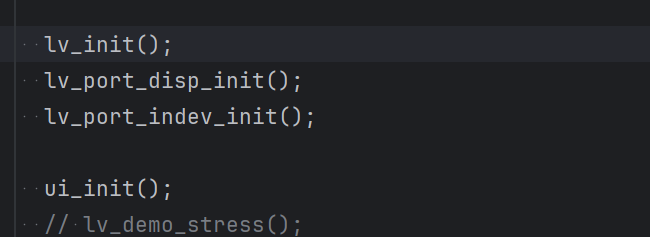
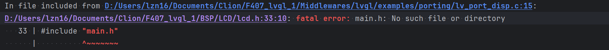

# Project Log
## 目标
1. lvgl移植显示比例程流畅
2. BSP所有模块都是硬件IIC，硬件SPI
3. 触摸屏流畅

## 工程进度记录

## 库和目录结构
1. 主执行目标:
2. stm32cubemx:stm32cubemx库：这个库是可以用户修改的，可以自定义函数，从驱动库里面修改函数
3. STM32_Drivers:stm32驱动库 驱动库是不能修改的，是已经配好的驱动函数
3. FreeRTOS:FreeRTOS库
5. lvgl:lvgl库

各个库链接情况
stmcubemx-----

## 技术要点
### lcd触摸屏
#### 显示功能
1. 显示功能实现
2. 显示功能函
```c
//lvgl显示设备初始化
void lv_port_disp_init(void) 

//
static disp_init(void)
static disp_flush(lv_disp_drv_t * disp_drv,const lv_area_t * area,lv_color_t * color_p)

```
#### 触摸功能
1.还会使用到24C02使用的是IIC协议，其实记录的是触摸校准的数据，保证触摸的精度
2. 总共五个函数,组成了触摸的驱动函数
```c
void lv_port_indev_init(void)
void touchpad_init(void)
void touchpad_read(lv_indev_drv_t * indev_drv,lv_indev_data_t * data)
void touchpad_is_pressed(void)
void touchpad_get_xy(lv_coord_t * x,lv_coord_t * y)
```
#### lvgl功能实现
1.必要函数，最后只需要在任务里面调用lv_init(),lv_port_disp_init();lv_port_indev_init(),ui_init()就可以了
2.


## bug
时间：2026.3.9 
1. 将软件24C02数据读写的IIC都改为硬件IIC  (完成)
3. 导致lcd.h文件无法找到，如何解决？（完成)
4. 把BSP的文件压缩到最小，尽量之包含LCD,Touch,LED和24C02
5. delay_us微秒延时函数实现          (完成)


时间：2026.3.10
1. lvgl库文件lv_port_disp.c找不到LCD.h文件:
分析： lvgl库链接stm32mx库的时候，就可以正常编译，但是lcd.h并没有封装在mx库里面，
2. lcd.h文件为什么找不到main.h文件，按道理来说(一个库的源文件件，路径，如果一个库库需要调用其他库源文件定义的函数，那么就需要通过链接语句)
target_link_libraries(${CMAKE_PROJECT_NAME} Public stm32mx)就行了
main.h文件在stm32mx库里面，而lcd.h文件是主执行目标里面的，只要主目标链接了stm32mx库，就可以找到lcd.h文件
但是奇怪的是lvgl库链接了stm32mx库就可以解决文件

时间：2026.3.12
1. lvgl显示模块，lv_port_disp.c文件修改（完成）
2. lvgl触摸模块，lv_port_indev.c文件修改（完成）
3. 胡乱链接库，导致很多重定义


